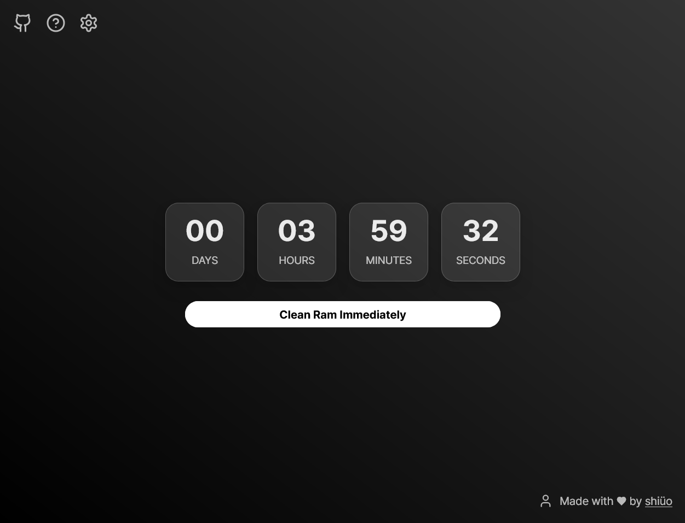
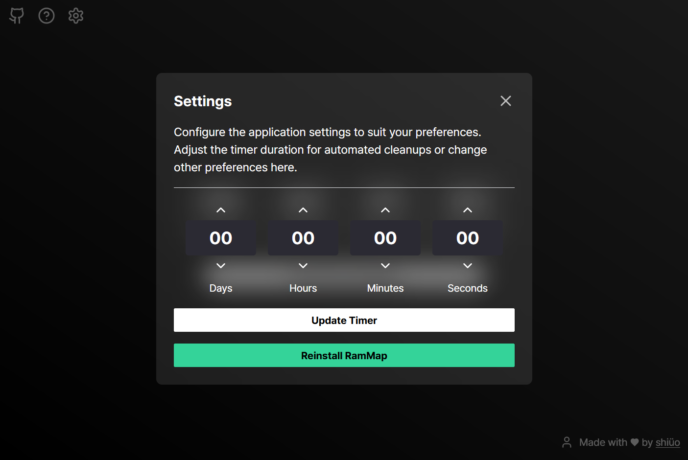

# RamZero
> Efficient and user-friendly RAM optimization tool

    

## 🚩 Table of Contents

- [Features](#-features)
- [Why RamZero?](#-why-ramzero)
- [Installation](#-installation)
- [Usage](#-usage)
- [Browser Support](#-browser-support)
- [Pull Request Steps](#-pull-request-steps)
- [Contributing](#-contributing)
- [License](#-license)

## 🎨 Features

- **Automatic RAM Cleanup**: Optimize memory at user-defined intervals
- **Manual Control**: Execute RAM cleanup instantly with one click
- **User-Friendly Interface**: Intuitive and sleek design
- **Customizable Settings**: Adjust the application to fit your specific needs
- **Real-time Monitoring**: Track and visualize memory usage in real-time(in development)

## 🤖 Why RamZero?

RamZero efficiently manages your system's RAM to optimize computer performance. Key advantages include:

- **Automated Memory Management**: Maintain system performance with regular RAM cleanups
- **Customizable**: Optimize settings according to individual usage patterns
- **Resource Efficient**: Operates with minimal system resources
- **Transparent Operation**: Works quietly in the background, minimizing disruption to user experience

## 🔧 Installation

1. Download the RamZero installer from the [latest release](https://github.com/shiueo/RamZero/releases/latest).
2. Run the downloaded installer file.
3. Follow the on-screen instructions to complete the installation.
4. Launch RamZero with administrator privileges after the installation is complete.

## 🐾 Usage

1. **Set Automatic Cleanup**:
   - Go to the settings menu to set the automatic cleanup interval.
   - Choose from preset time intervals or input a custom value.

2. **Execute Manual Cleanup**:
   - Click the "Clean Now" button on the main screen.
   - RAM cleanup will be executed immediately.

3. **Monitor Status**:
   - Check current RAM usage on the main screen.
   - Analyze memory usage trends over time through the graph.

For detailed usage instructions, refer to the [User Guide](https://github.com/shiueo/RamZero/wiki/User-Guide).

## 🔧 Pull Request Steps

1. Fork 'main' branch into your personal repository.
2. Clone it to your local computer.
3. Install dependencies.
4. Create a new feature or fix a bug.
5. Run tests to ensure your changes haven't broken existing functionality.
6. Commit your changes and push to your fork.
7. Create a pull request.

## 📜 License

This software is licensed under the [MIT](https://github.com/shiueo/RamZero/blob/master/LICENSE) © [shiüo](https://github.com/shiueo).